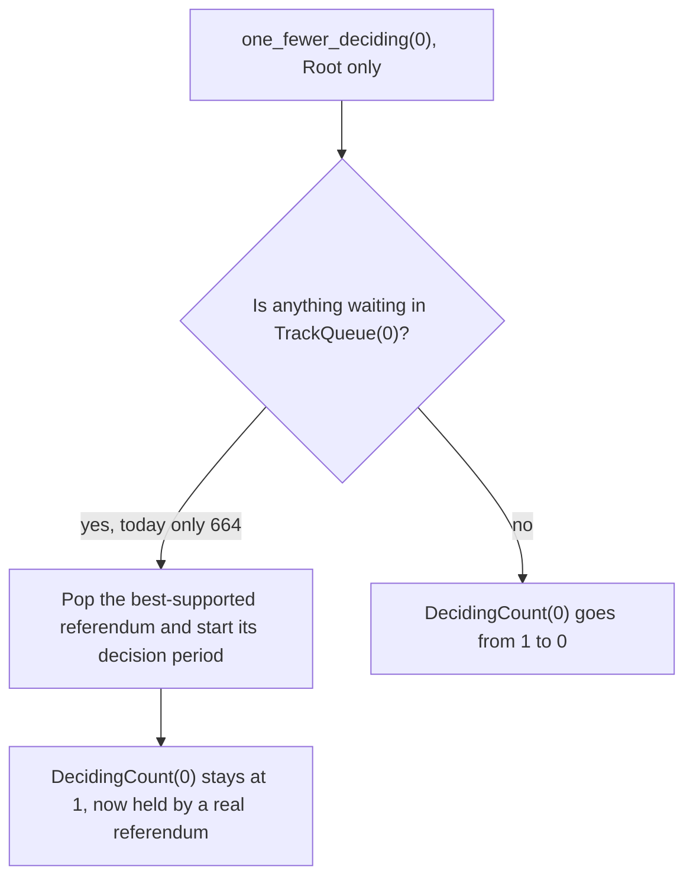
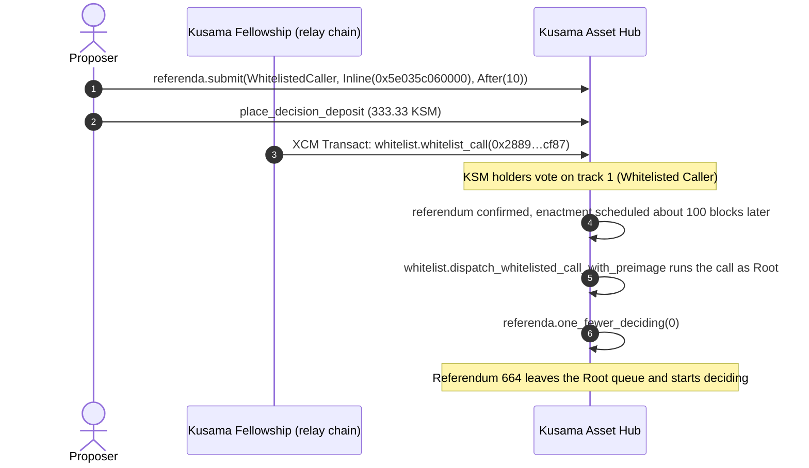

# Unblocking Kusama Referendum 664: Test Report

Oct 8, 2026 · @Dhiraj

**TL;DR.** This referendum frees the Root track on Kusama Asset Hub so that referendum 664 can start its decision period. The track allows one deciding referendum, and its counter says one is deciding when none is. So 664 has been stuck in the queue. The fix is one Root call, `referenda.one_fewer_deciding(0)`, enacted through the Whitelisted Caller track once the Kusama Fellowship whitelists it. On a fork of live Kusama Asset Hub, this exact call moved 664 into Deciding and passed 13 of 13 checks. Every claim below comes with a way to check it yourself.

## At a glance

| Item | Value |
| --- | --- |
| Chain | Kusama Asset Hub (`statemine` spec 2003002, fellows runtimes v2.3.2) |
| This referendum | [#668](https://kusama.subsquare.io/referenda/668), track 1 (Whitelisted Caller) |
| Fellowship referendum | Pending, to be submitted on the Kusama relay chain with the Fellows origin |
| Submission call | `0x5c005d0d01185e035c060000010a000000` |
| What it enacts | `0x5e035c060000` = `whitelist.dispatch_whitelisted_call_with_preimage(referenda.one_fewer_deciding(0))` |
| Hash the Fellowship whitelists | `0x2889dc24ab38fab7212e6f81adde354da22e3a24fc717dbf660e52e32afecf87` = blake2-256 of `0x5c060000` |
| Deposits | 0.0333 KSM submission, 333.33 KSM decision |
| Track 1 timing | 30 min prepare, up to 14 days deciding, 10 min confirm, 10 min minimum enactment |
| Test result | 13 of 13 checks passed on a fork of live Kusama Asset Hub |

Referendum 668 was submitted on 2026-10-08 at relay block 35,567,911, and its on-chain proposal is exactly `Inline(0x5e035c060000)`. The fork run below also produced index 668, because no other referendum was submitted on Kusama Asset Hub in between.

## The problem: a Root slot held by no referendum

The Root track (track 0) lets one referendum decide at a time. A queued referendum starts deciding only when `DecidingCount(0)` drops below 1. Today the counter reads 1, yet no Root referendum is deciding. Nothing will ever release that slot, so referendum 664 stays queued.

The live counts on Kusama Asset Hub, block 22,288,126:

| Track | Max deciding | `DecidingCount` stored | Actually deciding | Queue |
| --- | --- | --- | --- | --- |
| 0, Root | 1 | 1 | 0 | 664 |
| 1, Whitelisted Caller | 100 | 1 | 0 | empty |

Every other track's stored count matches its real count.

Referendum 664 proposes `registrar.deregister(2270)` on the Kusama relay chain, sent from Asset Hub over XCM. It was submitted at relay block 35,318,657, about 17 days ago. A queued referendum never times out, so without a fix 664 waits indefinitely.

Track 1 is also off by one. With 100 slots it blocks nothing, and this referendum leaves it alone.

## The fix: one Root call through the Whitelisted Caller track

`referenda.one_fewer_deciding(track)` is the pallet's own repair call for a deciding slot that was freed while the counter was not updated ([source](https://github.com/paritytech/polkadot-sdk/blob/70c5d8f98ac1156572f5957f5788ae2e619d9623/substrate/frame/referenda/src/lib.rs#L657-L692)). It requires Root, and on track 0 it takes one of two branches:



With 664 alone in the queue, the call starts 664's decision period. The counter stays at 1 and from then on counts a real referendum. If the queue is empty at enactment, for example because 664 was cancelled, the counter drops to 0. Either way the track ends up consistent.

Root comes from the whitelist. The Kusama Fellowship whitelists the hash of `0x5c060000` from the relay chain. A track 1 referendum then calls `whitelist.dispatch_whitelisted_call_with_preimage` with those bytes, and the pallet dispatches them as Root ([runtime config](https://github.com/polkadot-fellows/runtimes/blob/v2.3.2/system-parachains/asset-hubs/asset-hub-kusama/src/governance/mod.rs#L76-L78)).



The proposal is inline, so no preimage has to be noted. The requested 10-block delay is raised to the track's 100-block minimum, so the call runs about 10 minutes after confirmation.

Why this route:

- **A Root-track referendum** would queue behind 664 on the same blocked track and never start.
- **A runtime upgrade that recounts the tracks** needs a release cycle, and the upgrade would itself need Root or a whitelisted call.
- **One whitelisted call** uses an existing dispatchable, touches only track 0, and track 1 needs only 30 minutes of preparation and 10 minutes of confirmation.

## How we tested it

We forked live Kusama Asset Hub with Chopsticks at block 22,276,769 and ran the whole governance path with the exact bytes above. The run took place on 2026-10-07 from 14:29 to 14:50 UTC. Only two inputs were simulated:

- A test account (`//Alice`) received 20,000,000 KSM on the fork so it could pay both deposits and pass the vote alone.
- The Fellowship's whitelist message was injected as a downward XCM from the relay chain. It matches the message the live relay produces in a dry run, apart from the `SetTopic` tag the relay adds (step 3 of the next section).

Everything else ran through the unmodified runtime: signed extrinsics, the XCM barrier and origin checks, the referendum timing and the scheduler.

| Step | Fork block | Relay block | Key events |
| --- | --- | --- | --- |
| 1. Submit the exact call | 22,276,771 | 35,563,618 | `referenda.Submitted { index: 668, track: 1, proposal: Inline(0x5e035c060000) }` |
| 2. Place the decision deposit | 22,276,772 | 35,563,622 | `referenda.DecisionDepositPlaced { index: 668, amount: 333.33 KSM }` |
| 3. Fellowship XCM arrives | 22,276,773 | 35,563,626 | `whitelist.CallWhitelisted { 0x2889…cf87 }`, `messageQueue.Processed { origin: Parent, success: true }` |
| 4. Vote aye | 22,276,774 | 35,563,630 | `convictionVoting.Voted { Aye, 15,000,000 KSM }` |
| 5. Decision and confirmation start | 22,276,847 | 35,563,922 | `referenda.DecisionStarted { index: 668 }`, `referenda.ConfirmStarted { index: 668 }` |
| 6. Approved | 22,276,872 | 35,564,022 | `referenda.Confirmed { index: 668 }`, enactment set for relay block 35,564,118 |
| 7. Enactment | 22,276,897 | 35,564,122 | `whitelist.WhitelistedCallDispatched { Ok }`, `referenda.DecisionStarted { index: 664, track: 0 }`, `scheduler.Dispatched { Ok }` |

State just before and just after the enactment block:

| Query | Block 22,276,896 (before) | Block 22,276,897 (after) |
| --- | --- | --- |
| `referenda.referendumInfoFor(664)` | Ongoing, `inQueue: true`, `deciding: null` | Ongoing, `inQueue: false`, `deciding.since: 35,564,118` |
| `referenda.trackQueue(0)` | `[664]` | `[]` |
| `referenda.decidingCount(0)` | 1, held by no referendum | 1, held by 664 |
| `whitelist.whitelistedCall(0x2889…cf87)` | present | consumed |

The enactment block has no signed extrinsics: the scheduler ran the call during block initialization. Rewinding the fork to block 22,276,896 brought back the queued state, so that one block made the change.

All 13 checks in the script passed:

1. 664 is queued behind the occupied slot before the test.
2. Referendum 668 is submitted on track 1 with proposal `0x5e035c060000`.
3. The decision deposit is placed.
4. The downward XCM is processed successfully.
5. `WhitelistedCall(0x2889…cf87)` is set by the Fellowship XCM.
6. Referendum 668 is approved, with enactment at relay block 35,564,118.
7. 664 is still queued in the block before enactment.
8. The scheduler dispatches the enactment task with `Ok`.
9. The whitelisted call dispatches with `Ok`.
10. `referenda.DecisionStarted { index: 664, track: 0 }` is emitted.
11. 664 is deciding, the queue is empty and `DecidingCount(0)` is 1.
12. The whitelist entry is consumed.
13. After rewinding to the earlier block, 664 is queued again.

## Verify it yourself

Four checks, from a two-minute look in the browser to a full replay. Steps 1 to 3 only read from public RPC nodes and submit nothing.

### 1. Decode the bytes in Polkadot.js Apps

Open [Extrinsics → Decode on Kusama Asset Hub](https://polkadot.js.org/apps/?rpc=wss%3A%2F%2Fkusama-asset-hub-rpc.polkadot.io#/extrinsics/decode) and paste each value:

| Paste | You should see |
| --- | --- |
| `0x5c005d0d01185e035c060000010a000000` | `referenda.submit`, origin `WhitelistedCaller`, proposal `Inline(0x5e035c060000)`, enactment `After(10)` |
| `0x5e035c060000` | `whitelist.dispatchWhitelistedCallWithPreimage` wrapping `referenda.oneFewerDeciding(track: 0)` |
| `0x5c060000` | `referenda.oneFewerDeciding(track: 0)`, call hash `0x2889dc24ab38fab7212e6f81adde354da22e3a24fc717dbf660e52e32afecf87` |

The last hash must match the one the Fellowship referendum whitelists.

### 2. Check the stuck slot in Chain state

Open [Developer → Chain state](https://polkadot.js.org/apps/?rpc=wss%3A%2F%2Fkusama-asset-hub-rpc.polkadot.io#/chainstate) and query the `referenda` pallet:

- `decidingCount(0)` returns `1`.
- `trackQueue(0)` returns one entry, `664`.
- `referendumInfoFor(664)` returns `Ongoing` with `inQueue: true` and `deciding: null`.
- `referendumInfoFor(668)` returns `Ongoing` on track 1 with proposal `Inline(0x5e035c060000)`, the bytes you decoded in step 1.

Proving that no Root referendum is deciding means scanning every referendum, which step 3 does.

### 3. Run two scripts

You need Node.js 22 or later, which step 4's Chopsticks also requires.

```bash
mkdir verify-664 && cd verify-664
npm init -y > /dev/null
npm install @polkadot/api@17.0.2
# download the two scripts shown below
curl -O https://raw.githubusercontent.com/dhirajs0/polkadot-governance/main/kusama/referendum-664-root-track-fix/scripts/check-kah.js
curl -O https://raw.githubusercontent.com/dhirajs0/polkadot-governance/main/kusama/referendum-664-root-track-fix/scripts/check-fellowship.js
node check-kah.js
node check-fellowship.js
```

`check-kah.js` decodes the three calls against live Kusama Asset Hub, prints their hashes and recounts the Root track:

```javascript
// node check-kah.js   (needs: npm i @polkadot/api)
// Decodes the referendum call on live Kusama Asset Hub and shows the stuck Root track.
const { ApiPromise, WsProvider } = require('@polkadot/api');
const { blake2AsHex } = require('@polkadot/util-crypto');

const SUBMIT = '0x5c005d0d01185e035c060000010a000000'; // what you sign
const PROPOSAL = '0x5e035c060000';                     // what the referendum enacts
const INNER = '0x5c060000';                            // what the Fellowship whitelists

(async () => {
  const api = await ApiPromise.create({ provider: new WsProvider('wss://kusama-asset-hub-rpc.polkadot.io'), noInitWarn: true });
  const head = await api.rpc.chain.getHeader();
  console.log(`${api.runtimeVersion.specName} v${api.runtimeVersion.specVersion}, block ${head.number}`);

  for (const [name, hex] of [['submit', SUBMIT], ['proposal', PROPOSAL], ['inner', INNER]]) {
    const call = api.createType('Call', hex);
    console.log(`${name}: ${call.section}.${call.method} ${JSON.stringify(call.toHuman().args)}`);
    console.log(`  blake2_256 ${blake2AsHex(call.toU8a(), 256)}`);
  }

  const stored = (await api.query.referenda.decidingCount(0)).toNumber();
  const queue = (await api.query.referenda.trackQueue(0)).map(([i]) => i.toNumber());
  let deciding = 0;
  for (const [, v] of await api.query.referenda.referendumInfoFor.entries()) {
    const info = v.unwrap();
    if (info.isOngoing && info.asOngoing.track.eq(0) && info.asOngoing.deciding.isSome) deciding++;
  }
  console.log(`Root track: DecidingCount(0) = ${stored}, referenda actually deciding = ${deciding}, queue = ${JSON.stringify(queue)}`);
  const r664 = (await api.query.referenda.referendumInfoFor(664)).unwrap();
  if (r664.isOngoing) console.log(`664: inQueue=${r664.asOngoing.inQueue}, deciding=${r664.asOngoing.deciding.isSome ? JSON.stringify(r664.asOngoing.deciding.toJSON()) : "none"}`);
  else console.log(`664: ${r664.type}`);
  await api.disconnect();
})().catch((e) => { console.error(e); process.exit(1); });
```

Expected output (block number aside):

```text
statemine v2003002, block 22288194
submit: referenda.submit {"proposal_origin":{"Origins":"WhitelistedCaller"},"proposal":{"Inline":"0x5e035c060000"},"enactment_moment":{"After":"10"}}
  blake2_256 0x832472c328bf8fe7bcd19bbf8b1f876470ee96002fef10da75475a2737fa6b76
proposal: whitelist.dispatchWhitelistedCallWithPreimage {"call":{"args":{"track":"0"},"method":"oneFewerDeciding","section":"referenda"}}
  blake2_256 0x886f7270048667f524fd3a0c9bd71e536ef1042302a6ab7d292c7ec9db9b8c81
inner: referenda.oneFewerDeciding {"track":"0"}
  blake2_256 0x2889dc24ab38fab7212e6f81adde354da22e3a24fc717dbf660e52e32afecf87
Root track: DecidingCount(0) = 1, referenda actually deciding = 0, queue = [664]
664: inQueue=true, deciding=none
```

`check-fellowship.js` builds the Fellowship's message on the live Kusama relay and dry-runs it with the relay's `DryRunApi`:

```javascript
// node check-fellowship.js   (needs: npm i @polkadot/api)
// Dry-runs, on the live Kusama relay, the XCM the Fellowship sends to whitelist the fix. Read-only.
const { ApiPromise, WsProvider } = require('@polkadot/api');

const WHITELIST = '0x5e002889dc24ab38fab7212e6f81adde354da22e3a24fc717dbf660e52e32afecf87'; // KAH whitelist.whitelist_call(hash)

(async () => {
  const api = await ApiPromise.create({ provider: new WsProvider('wss://kusama-rpc.polkadot.io'), noInitWarn: true });
  console.log(`${api.runtimeVersion.specName} v${api.runtimeVersion.specVersion}`);
  const send = api.tx.xcmPallet.send(
    { V5: { parents: 0, interior: { X1: [{ Parachain: 1000 }] } } },
    { V5: [{ UnpaidExecution: { weightLimit: 'Unlimited', checkOrigin: null } }, { Transact: { originKind: 'Xcm', fallbackMaxWeight: null, call: { encoded: WHITELIST } } }] },
  );
  const submit = api.tx.fellowshipReferenda.submit({ Origins: 'Fellows' }, { Inline: send.method.toHex() }, { After: 10 });
  console.log(`fellowshipReferenda.submit ${submit.method.toHex()}`);
  const r = await api.call.dryRunApi.dryRunCall({ Origins: 'Fellows' }, send.method, 5);
  const ok = r.asOk;
  console.log(`dry run: ${ok.executionResult.isOk ? 'Ok' : JSON.stringify(ok.executionResult.toHuman())}`);
  for (const [dest, msgs] of ok.forwardedXcms) {
    console.log(`forwarded to ${JSON.stringify(dest.toHuman())}`);
    for (const m of msgs) console.log(`  ${JSON.stringify(m.toHuman())}`);
  }
  await api.disconnect();
})().catch((e) => { console.error(e); process.exit(1); });
```

Expected output: `dry run: Ok`, and one message forwarded to `Parachain 1000` with `DescendOrigin(Plurality { Technical, Voice })`, `UnpaidExecution`, `Transact(0x5e002889…cf87)` and a `SetTopic`. The `fellowshipReferenda.submit` bytes it prints are the Fellowship's proposal: `0x17002b0f01cc630005000100a10f05082f0000060300885e002889dc24ab38fab7212e6f81adde354da22e3a24fc717dbf660e52e32afecf87010a000000`.

### 4. Replay the whole run on your own fork

This repeats the test above, about 130 blocks, in roughly 20 minutes. From the `verify-664` folder:

```bash
# terminal 1: fork live Kusama Asset Hub
npx @acala-network/chopsticks@1.5.2 --endpoint=wss://kusama-asset-hub-rpc.polkadot.io --port=8013 --build-block-mode=Manual

# terminal 2: download and run the rehearsal
curl -O https://raw.githubusercontent.com/dhirajs0/polkadot-governance/main/kusama/referendum-664-root-track-fix/scripts/e2e-664-logged.cjs
node e2e-664-logged.cjs "$PWD" ws://127.0.0.1:8013 ./run
```

The script is [e2e-664-logged.cjs](scripts/e2e-664-logged.cjs). It ends with `RESULT PASS: 13/13 checks passed` and writes its evidence files to `./run`. Block numbers will differ from ours, and the checks do not depend on them.

## Limits and what could change before enactment

The test does not cover:

- **The Fellowship vote itself.** We injected its resulting XCM instead of running a Fellowship referendum on a relay fork. The live relay dry run (step 3) shows that referendum sends the same message, plus a `SetTopic`.
- **Real turnout and timing.** One test account passed the vote with 15,000,000 KSM. On the live chain, track 1's approval and support curves decide when it passes.

`one_fewer_deciding(0)` acts on the state at enactment, not at submission. What happens in each case:

| If, at enactment… | The call… | Outcome |
| --- | --- | --- |
| 664 is still the only queued Root referendum | starts 664's decision period | Intended result |
| A better-supported Root referendum has joined the queue | starts that one instead | 664 starts when that one ends and frees the slot |
| 664 was cancelled and the queue is empty | lowers `DecidingCount(0)` from 1 to 0 | Counter corrected, nothing starts |
| The counter was already fixed another way and a Root referendum is genuinely deciding | starts a second referendum on a one-slot track | New mismatch: re-run `check-kah.js` before voting ends |
| The Fellowship has not whitelisted the hash yet | fails with `CallIsNotWhitelisted` | Nothing changes, and a new referendum is needed |

The last row sets the order: the Fellowship referendum must enact before this one does. Live Kusama Asset Hub's whitelist pallet has no deferred dispatch to cover a late whitelist.

## Glossary

| Term | Meaning |
| --- | --- |
| Track | A governance lane with its own origin, deposits, timings and number of concurrent deciding referenda. Track 0 is Root, track 1 is Whitelisted Caller. |
| Deciding | The phase in which votes can pass a referendum. Each track allows at most `max_deciding` referenda in it at once. |
| `DecidingCount(track)` | The stored number of referenda deciding on a track. It should always equal the number of ongoing referenda on that track whose `deciding` field is set. |
| `TrackQueue(track)` | Referenda with a decision deposit that are waiting for a free slot, ordered by support. |
| Whitelist | The Fellowship approves one call hash. A Whitelisted Caller referendum can then dispatch exactly that call as Root. |
| Kusama Fellowship | The technical collective on the Kusama relay chain. Its Fellows origin whitelists calls on Asset Hub over XCM. |
| XCM, DMP | Cross-consensus messages. DMP (downward message passing) carries them from the relay chain to a parachain. |
| Inline proposal | Call bytes stored in the referendum itself, up to 128 bytes, so no separate preimage is needed. |
| Call hash | The blake2-256 hash of the SCALE-encoded call. The whitelist stores this hash. |
| Chopsticks | A tool that forks a live chain locally so you can build blocks on real state. |
| Dry run | `DryRunApi` executes a call against current chain state and returns the result without submitting anything. |

## Evidence and sources

| Item | Value |
| --- | --- |
| Fork source | `wss://kusama-asset-hub-rpc.polkadot.io` |
| Runtime | `statemine` spec 2003002 = polkadot-fellows/runtimes v2.3.2 (pallet-referenda 48.0.0, pallet-whitelist 47.0.0) |
| Fork head | 22,276,769, `0x6add2220fcd4b0075a368b4704d124db5079693cbcea6b5cdc88656df11bc2bc` |
| Block before enactment | 22,276,896, `0xf1198934dd95022ed451154240ae86059473e0dcc597d9121f9a973c952fe224` |
| Enactment block | 22,276,897, `0x7a0d17619c6c92f0b504fd2ff701887082f402833d22dc60d971eb8ec13d8f62` |
| Tools | Node.js 26.10.0, Chopsticks 1.5.2, @polkadot/api 17.0.2 |
| Live checks quoted here | Kusama Asset Hub blocks 22,288,126 to 22,288,194 and Kusama relay spec 2003002, on 2026-10-08 |

The run's evidence files are in [`evidence/`](evidence/). Check them by running `shasum -a 256 *` in that folder:

| File | Contents | sha256 |
| --- | --- | --- |
| `run.log` | Script output | `1bf170453b8f7d6b6d04a5eea1a979d977c647b291713e860db41bb0d5c4ce9b` |
| `run-meta.json` | Versions, fork head, key blocks, result | `e8766a61632f60a1176699df547b7a61d55dcb7c744c89e0c735b1feeb0a479d` |
| `checks.json` | Every check and its result | `ae0684022e6d5bb8e7ed36162b7e947fb247b4da56bcbc6a36606d7a0cf93b89` |
| `snapshots.json` | Referenda, whitelist and scheduler state at 7 points | `b1537c390e7aeb1cecfd65363d65c3f46ec112c7cd7b46230d165f55f4229563` |
| `transition-block.json` | Enactment block header, extrinsics and events | `2d2c9684e9160e045c774f69b7497d23136b9e8f37df5a97cb7f2e75953808ac` |
| `fellowship-xcm.json` | The injected XCM, decoded and encoded | `1cae2e0e5a22f5afc1f0492c12f14bb8342dabee8e68314f652b8dada65d21a2` |
| `blocks.jsonl` | All 128 fork blocks with their events | `e087458f4d762a59378e2eb11f85881e9f19f1dcc510748efdfdb54d77d9ac3d` |
| `chopsticks.log` | Fork process log, no WARN or ERROR entries | `80b33b498097c4bea642cb962160f7a676538e40c62e7cc2f52113742241690b` |

Code:

- [`one_fewer_deciding`](https://github.com/paritytech/polkadot-sdk/blob/70c5d8f98ac1156572f5957f5788ae2e619d9623/substrate/frame/referenda/src/lib.rs#L657-L692): starts the next queued referendum, or lowers the counter when the queue is empty.
- [`next_for_deciding`](https://github.com/paritytech/polkadot-sdk/blob/70c5d8f98ac1156572f5957f5788ae2e619d9623/substrate/frame/referenda/src/lib.rs#L1024-L1035): pops the best-supported queued referendum.
- [Undeciding timeout](https://github.com/paritytech/polkadot-sdk/blob/70c5d8f98ac1156572f5957f5788ae2e619d9623/substrate/frame/referenda/src/lib.rs#L1167-L1168): skipped while a referendum is queued.
- [Root track, `max_deciding: 1`](https://github.com/polkadot-fellows/runtimes/blob/v2.3.2/system-parachains/asset-hubs/asset-hub-kusama/src/governance/tracks.rs#L75-L76).
- [Whitelist origins](https://github.com/polkadot-fellows/runtimes/blob/v2.3.2/system-parachains/asset-hubs/asset-hub-kusama/src/governance/mod.rs#L76-L78): the Fellowship's voice over XCM whitelists, and Root or Whitelisted Caller dispatches.

The polkadot-sdk links point at master as of August 2026. The fork test exercised the pallet versions the live runtime uses.
